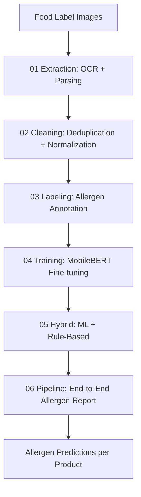

# 🏷️ Food Label Transparency for Filipino Consumers

**AI-based ingredient interpretation to detect allergens in food labels**  
A comprehensive notebook pipeline that extracts, processes, and analyzes food ingredient data using OCR, rule-based methods, and a MobileBERT model for multi-label allergen classification.

[](https://www.python.org/)
[](https://opensource.org/licenses/MIT)
[](https://jupyter.org/)
[](https://huggingface.co/)

---

## 📚 Table of Contents
- [Overview](#overview)
- [Notebook Pipeline](#notebook-pipeline)
- [Quick Start](#quick-start)
  - [Prerequisites](#prerequisites)
  - [Installation](#installation)
  - [Running the Notebooks](#running-the-notebooks)
- [Data Flow](#data-flow)
- [Configuration](#configuration)
- [Model Performance](#model-performance)
- [Troubleshooting](#troubleshooting)
- [Key Outputs](#key-outputs)
- [License](#license)

---

## 🔬 Overview
This project aims to enhance food label transparency for Filipino consumers by automatically detecting allergens from ingredient lists printed on food packaging. The pipeline combines:
- **Optical Character Recognition (OCR)** to extract text from label images
- **Rule-based parsing** to structure ingredient lists
- **MobileBERT fine-tuning** for multi-label allergen classification
- **Hybrid detection** merging ML predictions with rule-based patterns for high-confidence results

The system targets the eight major allergens recognized by the FDA: Milk, Eggs, Peanuts, Tree Nuts, Soy, Wheat, Fish, and Shellfish.

Data used in this project is sourced from OpenFoodFacts.

---

## 📓 Notebook Pipeline
Each notebook represents a stage in the end-to-end workflow. Run them sequentially for best results.

### 1. Data Extraction (`01_extraction.ipynb`)
- Extracts ingredient text from food label images using **pytesseract** (OCR)
- Parses raw OCR output into structured ingredient entries
- Saves intermediates to **DuckDB** and **CSV** for downstream use

### 2. Data Cleaning (`02_cleaning.ipynb`)
- Deduplicates records and removes invalid/empty entries
- Normalizes ingredient names (lowercase, stripping punctuation, handling synonyms)
- Addresses missing values and inconsistencies
- Outputs a cleaned dataset ready for annotation

### 3. Enhanced Labeling (`03_labeling_enhanced.ipynb`)
- Assigns allergen labels to each ingredient using FDA-defined categories
- Generates a multi-label training dataset (one-hot encoded per allergen)
- Includes validation checks for annotation consistency
- Exports labeled CSV for model training

### 4. Model Training (`04_model_training.ipynb`)
- Fine-tunes **MobileBERT** (Hugging Face Transformers) for multi-label classification
- Implements stratified train/validation/test splits to preserve class distribution
- Uses **Weighted Binary Cross-Entropy** loss to mitigate class imbalance
- Optimizes prediction thresholds per allergen via validation set
- Saves the trained model and training metadata

### 5. Hybrid Detection (`05_hybrid.ipynb`)
- Loads the pre-trained MobileBERT model
- Combines rule-based allergen patterns (e.g., keyword matching) with ML probabilities
- Produces final allergen confidence scores (0–1) per ingredient
- Evaluates hybrid performance on the held‑out test set
- Exports `model_thresholds.json` for production deployment

### 6. OCR + Hybrid Pipeline (`06_ocr_hybrid_pipeline.ipynb`)
- End‑to‑end demo: **Image → OCR → Cleaned Ingredients → Hybrid Predictions → Allergen Report**
- Generates a human‑readable CSV report showing detected allergens per product
- Includes error analysis (false positives/negatives) and performance metrics (precision, recall, F1)

---

## 🚀 Quick Start

### Prerequisites
- Python ≥ 3.9
- Git
- Tesseract OCR installed (see [tesseract setup](https://github.com/tesseract-ocr/tesseract))
- (Optional) GPU for faster training

### Installation
```bash
# Clone the repository
git clone https://github.com/your-username/food-label-transparency.git
cd food-label-transparency

# Create a virtual environment (recommended)
python -m venv venv
source venv/bin/activate   # Windows: venv\Scripts\activate

# Install dependencies
pip install -r requirements.txt
```
> **Tip:** If you don’t have a `requirements.txt`, run:
> ```bash
> pip install torch transformers pandas numpy scikit-learn pillow pytesseract duckdb
> ```

### Running the Notebooks
Launch Jupyter Lab/Notebook and execute the notebooks in order:
```bash
jupyter lab   # or jupyter notebook
```
Then open:
1. `01_extraction.ipynb`
2. `02_cleaning.ipynb`
3. `03_labeling_enhanced.ipynb`
4. `04_model_training.ipynb` *(optional if you only want to infer)*
5. `05_hybrid.ipynb`
6. `06_ocr_hybrid_pipeline.ipynb`

Each notebook contains executable cells with clear markdown explanations.

---

## 📊 Data Flow


---

## 🔧 Configuration

### Key Directories
| Path | Description |
|------|-------------|
| `../models/mobilebert_allergen_final/` | Stores the fine‑tuned MobileBERT weights and tokenizer |
| `../models/hybrid_config.json` | Hybrid configuration with ML thresholds and rule parameters |
| `../configs/model_thresholds.json` | Optimal probability thresholds per allergen (alternative location) |
| `../data/raw/` | OCR outputs and parsed ingredients (CSV/DuckDB) |
| `../data/clean/` | Cleaned ingredient tables |
| `../data/labeled/` | Ingredient‑allergen matrix for training |
| `../data/predictions/` | Final allergen reports (CSV) |
| `../notebooks/` | Jupyter notebooks for each pipeline stage |

### Allergen Classes
1. Milk  
2. Eggs  
3. Peanuts  
4. Tree Nuts  
5. Soy  
6. Wheat  
7. Fish  
8. Shellfish  

*(Modify `configs/allergen_map.json` if you need to add/remove classes.)*

### Threshold Usage
The model uses probability thresholds for each allergen class to convert model outputs to binary predictions. These thresholds are optimized during validation to maximize F1-score for each class:

- **ML thresholds**: Found in `../models/hybrid_config.json` (optimized for hybrid system)
- **Alternative thresholds**: Found in `../configs/model_thresholds.json` (from earlier experiments)

To use custom thresholds in inference, load them and pass to the prediction function:
```python
import json
import numpy as np

# Load thresholds
with open('../models/hybrid_config.json', 'r') as f:
    config = json.load(f)
thresholds = np.array(config["ml_thresholds"])

# Use in prediction
preds, probs = predict_ml(texts, thresholds=thresholds)
```

---

## 📈 Model Performance
| Metric | Milk | Eggs | Peanuts | Tree Nuts | Soy | Wheat | Fish | Shellfish |
|--------|------|------|---------|-----------|-----|-------|------|-----------|
| Precision | 0.97 | 1.00 | 0.80 | 0.91 | 0.93 | 1.00 | 1.00 | 1.00 |
| Recall | 0.92 | 0.90 | 1.00 | 0.96 | 1.00 | 0.98 | 1.00 | 0.60 |
| F1‑Score | 0.95 | 0.95 | 0.89 | 0.93 | 0.96 | 0.99 | 1.00 | 0.75 |

- **Framework:** Hugging Face `transformers` + `pytorch`
- **Base Model:** `google/mobilebert-uncased`
- **Loss:** Weighted Binary Cross‑Entropy (inverse class frequency)
- **Optimizer:** AdamW with linear warm‑up and cosine decay
- **Training Time:** ~25 min on a single RTX 3060 (6 GB VRAM)
- **Inference Latency:** ~12 ms per ingredient on CPU

*Numbers are from the test set evaluation in `04_model_training.ipynb`.*

---

## 🛠️ Troubleshooting

| Issue | Solution |
|-------|----------|
| **GPU OOM** | Reduce `batch_size` in `04_model_training.ipynb`; enable `gradient_accumulation_steps`. |
| **Slow OCR** | Ensure input images are ≥300 DPI; apply deskewing and contrast adjustment (see OpenCV snippets in the extraction notebook). |
| **Low Recall for Rare Allergens** | Increase class weight for that allergen in the loss function; collect more labeled examples. |
| **Module Not Found (e.g., `duckdb`)** | Install via `pip install duckdb`; verify you’re using the correct virtual environment. |
| **Threshold Tuning** | Adjust thresholds in `05_hybrid.ipynb` → search for `threshold_dict`; optimize using validation precision‑recall curves. |

---

## 📦 Key Outputs
- **`../models/mobilebert_allergen_final/`** – Trained MobileBERT checkpoint & tokenizer
- **`../data/predictions/allergen_report.csv`** – Per‑product allergen flags + confidence scores
- **`../configs/model_thresholds.json`** – Optimal probability thresholds per allergen
- **`../notebooks/06_ocr_hybrid_pipeline.ipynb`** – End‑to‑end demo with visualizations
---

## 📜 License
This project is licensed under the MIT License – see the [LICENSE](LICENSE) file for details.

---

*Last updated: June 20, 2026*  
*Version: 1.1.0*